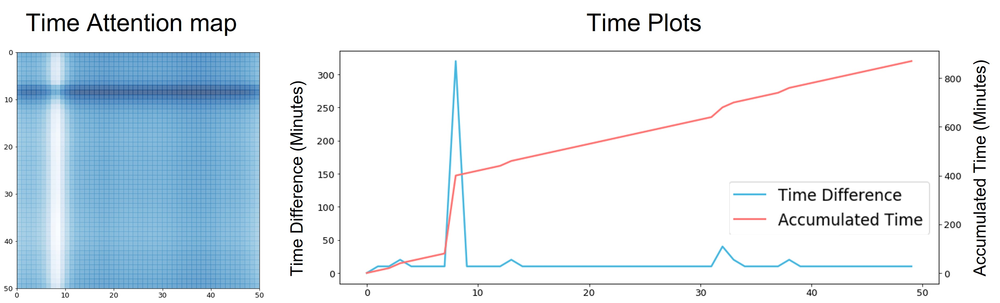
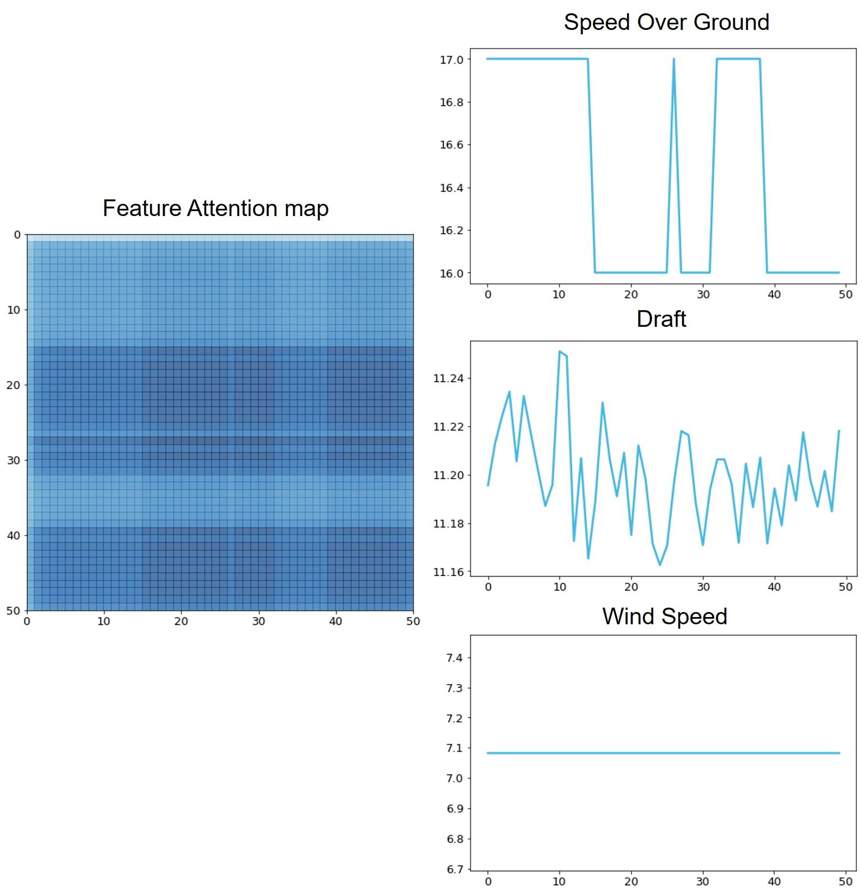

# Time aware and Feature similarity Self Attention in Vessel Fuel Consumption Prediction

This is a Pytorch implementation of [Time aware and Feature similarity Self Attention in Vessel Fuel Consumption Prediction](https://www.mdpi.com/2076-3417/11/23/11514). Time aware Attention (TA) emphasizes data in the sequence by considering irregular time intervals. Feature similarity Attention (FA) estimates feature importance and similarities to emphasize data. Finally, the ensemble model of TA and FA-based BiLSTM can simultaneously represent both time and feature information. This repository only addresses the models with BiLSTM as the backbone. However, TA and FA as the attention modules can be easily applied in other backbones such as Transformer.
\
\
The overall architecture and attention process are as below:

<center></center>
<center></center>

The models are designed to consider data properties, (i.e., sequential, irregular time, feature importance). The repository supports BiLSTM (BASE), Self-Attention (SA) with BiLSTM, TA with BiLSTM, FA with BiLSTM, and Ensemble. Notice that the repositoy does not support dataset.
 

# Installation & Enviornment

The OS, python and pytorch version needs as below:
- Windows / Linux 
- python >= 3.7.4
- pytorch >= 1.7.1

You can install requirements through git and requirements.txt except for pytorch and torchaudio.
```C
git clone https://github.com/winddori2002/Time-aware-and-Feature-similarity-Self-Attention.git
cd Time-aware-and-Feature-similarity-Self-Attention
pip install -r requirements.txt
```

# Usage

Since the repository does not support datasets, it is necessary to fit your data into the code.
Other numeric features can be used easily, but you need to get the ```"time diff"``` feature, which is the
time difference right before data in the sequence. The unit of time diff in the paper is a minute.
Otherwise, you can use the part of the model and attention modules.

## 1. Train

### Training with default settings

You can train the model with default setting by running the following code.
If you want to train the ensemble model, you should have trained both TA and FA before.

```C
python main.py train --att_type [attention type]
```

### Training with other arguments
If you want to edit model settings, you can run the following code with other arguments. 

In ```config.py```, you can find other arguments, such as batch size, epoch, and so on.

```
Model Arguments:
  --input_size: Input size (number of features, default:16)
  --output_size: Output size (default:1)
  --hidden_size: hidden size (default:4)
  --sequence_length: Sequence length (default:50)
  --num_layers: Number of layers (default:3)
  --dropout: Dropout ratio (default:0.1)
  --att_type: Attention type (BASE, SA, TA, FA, ENS)
  
Setting arguments:
  --epoch: Number of epochs (default:100)
  --batch_size: Batch size (default:200)
  --lr: Learning rate (default:0.001)
  --device: Cuda device (default:cuda:0)
  --logging: Logging option (default:False)
```

## 2. Test

After training, you can evaluate the model in terms of RMSE and MAE by running the code below.

```C
python main.py test --att_type [attention type]
```

# Visualizations

You can visualize the model results (feature importance parameters, attention map). They suggest interpretable results to understand the model and data. We provide some examples of the results.

## 1. Feature importance
### Estimated feature importance from FA model. Feature importance is learnable parameters.
You can find important features by visualizing learnable feature importance parameters.

<center></center>

## 2. TA attention map
### One example of TA attention map. 
We notice that TA ignores points where the time difference increases rapidly.

<center></center>

## 3. FA attention map
### One example of FA attention map. 
We notice that FA makes symmetric attention maps and FA is especially affected by Speed.

<center></center>

# Citation

If you use the code in your paper, then please cite it as:
```C
@article{park2021time,
  title={Time-Aware and Feature Similarity Self-Attention in Vessel Fuel Consumption Prediction},
  author={Park, Hyun Joon and Lee, Min Seok and Park, Dong Il and Han, Sung Won},
  journal={Applied Sciences},
  volume={11},
  number={23},
  pages={11514},
  year={2021},
  publisher={Multidisciplinary Digital Publishing Institute}
}
```
